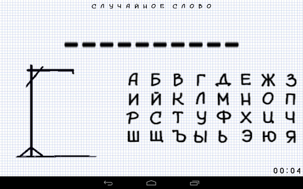

# Welcome to the 'Viselitsa'



## Introduction
This is Ruby implementation of the classic Viselitsa (Hungman) game

Language: Russian

## Descriptioin
Full description and rules - [Russian Wiki](https://ru.wikipedia.org/wiki/%D0%92%D0%B8%D1%81%D0%B5%D0%BB%D0%B8%D1%86%D0%B0_(%D0%B8%D0%B3%D1%80%D0%B0)) / [English Wiki](https://en.wikipedia.org/wiki/Hangman_(game))

The game is for one or more players.

Player tries to guess the word by suggesting letters or numbers, within a certain number of guesses, 
there is only seven attempts.

After each unsuccessful attempt to guess the letter, part of the gallows(viselitsa) is drown.

## Requirements

1. Ruby - any version

2. Linux/Windows/ Mac OS

## Getting Started

1. Clone the **visilitsa** repository

2. Get your terminal window into **visilitsa** derictory

3. If your Ruby version 1.9 and lower you need to install gem "unicode_utils"

   ``` $ bundle install ```

   See Gemfile

4. To start game

``` $ ruby main.rb```

## Adding new words for program
You can to add new words for program guessing. Open file folder

```/data/words.txt```

and to add any words for next playing

### Good Luck!
